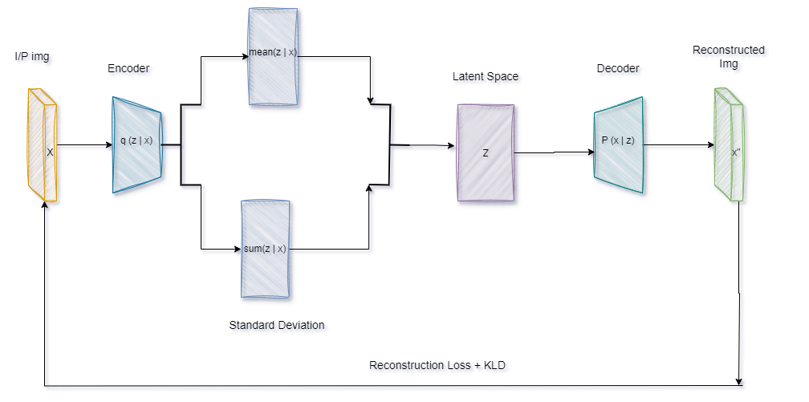

<h1 align="center">Hi 👋, it's a Image Generation By VAE pytorch from scratch </h1>
<h3 align="center">
  
</h3>

- 🌱 If you want to explore and practice more on image genration. here, you can find how to implement VAE using pytorch from scrach and apply it on anime dataset

- 🔭 this project inheritance from Eng [Amr Abdellatif](https://www.youtube.com/watch?v=6qhkkouZ5bw&list=PLhBhgortqAcgiwIa7drJtBuPK_pCrnmvw&index=6&t=5s) (if you are arabian, i recommend to watch this playlist to practice more on using pytorch on [YouTube](https://youtube.com/playlist?list=PLhBhgortqAcgiwIa7drJtBuPK_pCrnmvw&si=zC3ROnl_OUsv82hL) 

- 🌱 The anime dataset is fetched form [Kaggle](https://www.kaggle.com/datasets/splcher/animefacedataset) 
